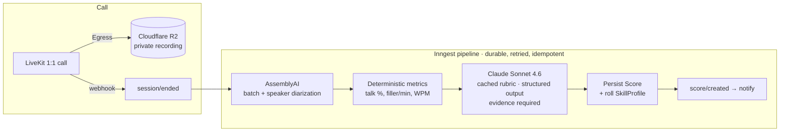

# Sales Roleplay

> The **"GitHub for sales reps."** Practice live, scenario-based sales roleplay calls with a peer, get **AI analysis and scoring** against a rubric after every call, and build a **verifiable, skill-based portfolio** that recruiters and managers can trust.

<p>
  
  
  
  
  
  
</p>

Sales professionals improve mainly through live reps, but real reps are scarce, high-stakes, and rarely scored objectively — and recruiters have no reliable way to evaluate someone's *actual* selling ability before a hire. Sales Roleplay pairs practitioners for **1:1 video roleplays**, scores the seller with a **mix of deterministic metrics and an LLM judge**, and turns every call into a showcaseable rep.

---

## Table of contents

- [Core loops](#core-loops)
- [How it works](#how-it-works)
- [Tech stack](#tech-stack)
- [Monorepo layout](#monorepo-layout)
- [Getting started](#getting-started)
- [Environment variables](#environment-variables)
- [Running the full pipeline locally](#running-the-full-pipeline-locally)
- [Scripts](#scripts)
- [Documentation](#documentation)
- [Conventions](#conventions)
- [License](#license)

---

## Core loops

- **Practitioner:** match → roleplay → AI score → improve → showcase.
- **Recruiter / manager:** browse and filter scored candidates → review recorded reps → shortlist → contact.

Scoring covers four skill tracks — **DM / cold setting, objection handling, discovery, and closing** — across eight rubric dimensions (six LLM-judged, two computed).

## How it works

**Live call → recording → scoring** is asynchronous and durable: the request path never blocks on transcription or an LLM.



- **Deterministic dimensions** (talk/listen ratio, filler & pace) are pure functions over the diarized transcript — no LLM, cheaper, and harder to game.
- **LLM-judged dimensions** are scored by Claude against **anchored 0/50/100 rubric descriptions**, and **every dimension must cite transcript turns as evidence** (rejected + auto-corrected otherwise).
- **Matchmaking** pairs users **atomically on enqueue** via a single Redis Lua script (Upstash) — race-safe, complementary roles, similar level/difficulty, not recently matched — then routes both through a **lobby** (role-scoped briefs, ready-gating) into the call.

The scoring rubric, output contract (zod), deterministic metrics, weighting, and a calibration set all live as **pure, unit-tested code** in [`packages/core`](packages/core).

## Tech stack

| Layer | Choice |
|---|---|
| Language | **TypeScript** everywhere (no JS files) |
| Web / API | **Next.js 16** (App Router, Turbopack) · **tRPC v11** · TanStack Query |
| UI | **Tailwind v4** + shadcn-style primitives |
| Auth | **Clerk v7** (organizations + roles) |
| Database | **PostgreSQL on Neon** + **Prisma 7** (Neon driver adapter; pooled at runtime, direct for migrations) |
| Real-time calls | **LiveKit Cloud** (WebRTC + Egress recording) |
| Matchmaking queue | **Upstash Redis** (REST; atomic Lua pairing) |
| Background jobs | **Inngest** (durable, retried, idempotent) |
| Transcription | **AssemblyAI** (batch + speaker diarization) |
| AI scoring | **Anthropic Claude** (Sonnet 4.6 default; prompt caching + structured output) |
| Object storage | **Cloudflare R2** (private bucket; short-lived signed URLs) |

Fully managed / serverless — **no Docker in production**.

## Monorepo layout

pnpm workspace:

```
apps/
  web/            Next.js app — UI, tRPC routers, webhooks, /api/inngest serve endpoint
packages/
  config/         zod-validated env schema (server/client) + shared eslint/tsconfig
  core/           shared enums + domain zod schemas; scoring/ (rubric, contract,
                  metrics, prompt, aggregate, calibration) and matchmaking config
  db/             Prisma 7 schema, migrations, generated client, seed
  jobs/           Inngest client + functions (scoring pipeline) + provider wrappers
docs/             PRD, DevOps handover, and CLAUDE.md (engineering guide)
```

Shared types and domain logic go in `packages/core`; all DB access stays in `packages/db`; app/page code reads through tRPC — never ad-hoc Prisma in pages.

## Getting started

**Prerequisites:** Node ≥ 20, pnpm ≥ 10, and a Neon Postgres database. Full functionality also needs Clerk, LiveKit, Upstash, AssemblyAI, Anthropic, and Cloudflare R2 accounts (see [Environment variables](#environment-variables)).

```bash
# 1. Install
pnpm install

# 2. Configure env (names-only reference is committed; never commit real values)
cp .env.example .env      # then fill in real values

# 3. Set up the database
pnpm db:generate          # generate the Prisma client
pnpm db:migrate           # apply migrations to your Neon dev branch
pnpm db:seed              # seed an admin user + the starter scenario library

# 4. Run
pnpm dev                  # → http://localhost:3000
```

> Enable **Organizations** in the Clerk dashboard, and point a Clerk webhook at `/api/webhooks/clerk` (`user.*`, `organization.*`, `organizationMembership.*`) with `CLERK_WEBHOOK_SIGNING_SECRET`. In local dev the app self-heals the current user's row, so the webhook is only required for full org sync.

## Environment variables

Validated at boot by a zod schema in `packages/config` — a missing required var fails fast. See [`.env.example`](.env.example) for the complete, commented list. Grouped by concern:

| Group | Keys |
|---|---|
| App | `NODE_ENV`, `NEXT_PUBLIC_APP_URL` |
| Clerk | `NEXT_PUBLIC_CLERK_PUBLISHABLE_KEY`, `CLERK_SECRET_KEY`, `CLERK_WEBHOOK_SIGNING_SECRET`, sign-in/up URLs |
| Neon | `DATABASE_URL` (pooled, `-pooler`), `DIRECT_URL` (direct — migrations only) |
| LiveKit | `NEXT_PUBLIC_LIVEKIT_URL`, `LIVEKIT_API_KEY`, `LIVEKIT_API_SECRET` |
| Cloudflare R2 | `R2_ACCOUNT_ID`, `R2_ACCESS_KEY_ID`, `R2_SECRET_ACCESS_KEY`, `R2_BUCKET` |
| Scoring | `ASSEMBLYAI_API_KEY`, `ANTHROPIC_API_KEY` |
| Inngest | `INNGEST_EVENT_KEY`, `INNGEST_SIGNING_KEY` (optional locally) |
| Upstash | `UPSTASH_REDIS_REST_URL`, `UPSTASH_REDIS_REST_TOKEN` |

> **Never commit real secrets.** `.env` is gitignored; only `.env.example` (names/placeholders) is tracked.

## Running the full pipeline locally

The async scoring jobs run in Inngest. Alongside `pnpm dev`, start the Inngest dev server:

```bash
npx inngest-cli@latest dev -u http://localhost:3000/api/inngest
# dashboard → http://localhost:8288
```

Verify a change with real behavior (needs real `ASSEMBLYAI_API_KEY` + `ANTHROPIC_API_KEY`): complete a recorded call, watch the `score-session` run in the Inngest dashboard, and confirm a `Score` (`COMPLETE`) + updated `SkillProfile` in `pnpm db:studio`.

**Scoring calibration** (guards against rubric/model drift, PRD §6.4):

```bash
# deterministic half runs in the normal test suite (no API key)
pnpm test

# live LLM calibration (scores reference reps against Claude; needs a real key, costs credits)
ANTHROPIC_API_KEY=sk-... pnpm --filter @sr/jobs test
```

## Scripts

| Command | What |
|---|---|
| `pnpm dev` | run the web app (Next dev, Turbopack) |
| `pnpm build` | production build |
| `pnpm lint` | ESLint across all packages |
| `pnpm typecheck` | `tsc --noEmit` across all packages |
| `pnpm test` | unit tests (Vitest) |
| `pnpm db:generate` | `prisma generate` |
| `pnpm db:migrate` | `prisma migrate dev` (local) |
| `pnpm db:deploy` | `prisma migrate deploy` (CI/prod) |
| `pnpm db:studio` | Prisma Studio |
| `pnpm db:seed` | idempotent seed (admin + scenario library) |
| `pnpm format` / `format:check` | Prettier |

**Always run `pnpm lint` and `pnpm typecheck` before considering work done.**

## Documentation

- [`docs/PRD.md`](docs/PRD.md) — product spec, roles, the full AI scoring system, data model, phased plan.
- [`docs/devops-handover.md`](docs/devops-handover.md) — environments, CI/CD, secrets, webhooks, observability, runbooks.
- [`docs/CLAUDE.md`](docs/CLAUDE.md) — engineering guide: architecture rules, conventions, current status, and per-phase notes.

## Conventions

- **Type safety end to end** — no `any`; validate all external input (forms, webhooks, env) with **zod**; infer types from Prisma and zod rather than duplicating them.
- **Webhooks do minimal work** — verify signature → persist → enqueue. All transcription/scoring is async in Inngest (retried, idempotent).
- **Authorize every read** in the tRPC layer, not just the UI (e.g. a user only sees their own reps; recruiters only see *showcased* reps).
- **Security** — recordings live in a private R2 bucket and are served only via short-lived signed URLs; least-privilege keys; never log secrets or PII.
- **Migrations are backward-compatible** (expand-then-contract).
- kebab-case files · PascalCase components · camelCase functions · small conventional commits.

## License

Private and proprietary. All rights reserved. Not licensed for external use or distribution.
